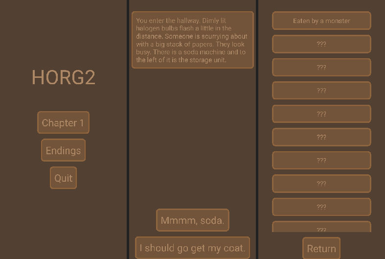

# visual-novel-react-native

## Features
-> Interactive Visual Novel App

-> Reads dialogue/story data from JSON

-> Branching dialogue trees

-> Input images into the story
## How to Use
-> Write story in JSON, example:
```JSON
{
  "1":
    {
      "dialogue": "This is a example story.",
      "image": "image_name",
      "choice_1": [2, "Press this choice."],
      "choice_2": [3, "No, press this choice!"],
      "ending": [101, "This leads to a ending."]
    }
}
```
-> "dialogue" and "image" control what shows on the specific dialogue page.

-> "choice_n" and "ending" control dialogue tree pathing. `choice_n[0]` points to the dialogue index to load next. `choice_n[1]` shows up on the ChoiceButton.

-> `ending[0]` on the other hand points to which ending to give the player. Achieved endings are saved in a AsyncStorage. The data/endings.json file keeps the strings to show in the Endings Page per ending.
## Install
1. Clone repo
2. run `npm install`
3. run `npx expo start`
4. Connect to Expo Go on phone by reading the QR-code
